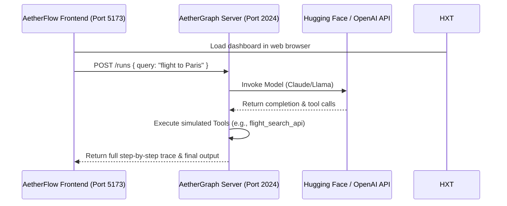

# AetherFlow

[](https://vite.dev)
[](https://developer.mozilla.org/en-US/docs/Web/JavaScript)
[](https://developer.mozilla.org/en-US/docs/Web/CSS)
[](https://nodejs.org)
[](https://huggingface.co)
[](https://slack.com)
[](https://github.com)
[](https://pagerduty.com)

AetherFlow is a state-of-the-art developer platform for LLM application observability, tracing, evaluation, prompt playgrounds, and multi-agent swarm orchestration. 


https://github.com/user-attachments/assets/ca51c446-0980-4a6b-af6e-a91edf0db5e1


It provides real-time visualization of agent runs, evaluation metrics, and local agent code execution, serving as a comprehensive open-source alternative to LangSmith and LangChain tracing.

---

## Table of Contents
1. [What is AetherFlow?](#what-is-aetherflow)
2. [Key Components](#key-components)
3. [Architecture Overview](#architecture-overview)
4. [Getting Started](#getting-started)
5. [Integrations](#integrations)
6. [License](#license)

---

## What is AetherFlow?

AetherFlow is built to address the visibility gap in modern LLM applications and agentic swarms. It allows developers to:
- **Trace & Debug**: Capture step-by-step telemetry of LLM chains, agent routers, and tool execution loops.
- **Orchestrate Swarms**: Visualise and design complex, multi-agent state machines via **AetherGraph Studio**.
- **Evaluate & Optimize**: Run prompt comparisons and run automated evaluators (toxicity, correctness, semantic similarity) against curated datasets.
- **Playground & Embed**: Interactive prompt playground supporting Hugging Face models, streaming tokens, and direct playground integrations.

---

## Key Components

### 1. Tracing & Observability
Capture structured traces from agent loops. View invocation details, input parameters, output parameters, and detailed step-by-step logs for nested model calls and tools.

### 2. AetherGraph Studio
A visual orchestrator representing agentic state graphs. Node transitions (`__start__` -> `model` -> `tools` -> `__end__`) are represented dynamically with live execution pulses and status indicators.

### 3. Monitoring & Telemetry
Interactive dashboards with metrics for latency, cost, and success rate, plotted using custom Chart.js visualization. Filter traces by latency threshold, status, tags, and run type.

### 4. Datasets & Experiments
Import test collections, run prompt templates against them, and track historical experiments to prevent regression as LLM prompts change.

### 5. Integrations & Alert Manager
A unified configuration system supporting:
- **Hugging Face**: Connect Hugging Face Inference API via personal tokens to stream open-source models in the playground.
- **Slack & PagerDuty**: Forward automated regression alerts and agent execution failures directly to Slack channels and incident management queues.

---

## Architecture Overview

The codebase is split into two primary components:
1. **Frontend Dashboard (Vite)**:
   - High-fidelity single page application (SPA) styled with vanilla CSS (no heavy utility libraries, maximum control).
   - Custom state-based client-side router (`js/router.js`).
   - Chart rendering for latency/runs and dynamic UI elements.
2. **Local AetherGraph Agent Server (Node.js)**:
   - Simple light-weight server running on port `2024`.
   - Simulates agent flows (e.g., flight swarms, weather lookups, RAG engines) and logs JSON traces back to the frontend.



---

## Getting Started

### Prerequisites
- Node.js (version 18 or higher)
- npm (version 9 or higher)

### Setup & Installation

1. **Clone the Repository**:
   ```bash
   git clone https://github.com/AetherFlow-ai/aetherflow.git
   cd aetherflow
   ```

2. **Install Dependencies**:
   ```bash
   npm install
   ```

3. **Start the Frontend Dashboard**:
   ```bash
   npm run dev
   ```
   Open your browser to `http://localhost:5173`.

4. **Start the Local AetherGraph Agent Server**:
   ```bash
   npm run server
   ```
   The local agent server will boot on port `2024` with CORS headers preconfigured to allow connections from the dashboard.

---

## Integrations

### Hugging Face
To stream Hugging Face models:
1. Head to the **Settings** tab in the dashboard.
2. Under **Integrations**, toggle **Hugging Face API**.
3. Paste your Hugging Face Access Token (`hf_...`) and click **Save**.
4. Go to the **Playground**, select one of the Hugging Face models (e.g., `meta-llama/Llama-3-8B-Instruct`), and test prompts with streaming status logs.

### Slack Webhooks & PagerDuty
1. Toggle the respective integrations under the Settings menu.
2. Provide your webhook URL or integration key.
3. Use the **Test Integration** button to verify network triggers.

---

## License

This project is licensed under the Apache-2.0 License - see the LICENSE file for details.
